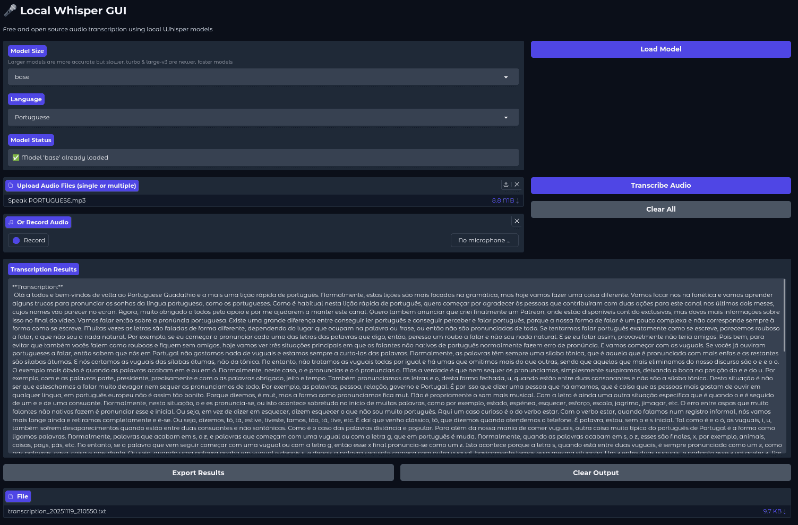

# Near Whisper - Local Audio Transcription

A free and open source GUI for local Whisper audio transcription on Fedora Linux systems.

[](https://opensource.org/licenses/MIT)
[](https://getfedora.org/)

## Overview

Near Whisper is a Gradio-based web interface for OpenAI's Whisper speech recognition model that runs entirely locally on your machine. No internet connection required after initial setup, ensuring complete privacy for your audio data.

## Preview



## Features

- 🎤 Microphone recording and file upload (single or batch)
- 🌍 Multiple language support with auto-detection
- 🔒 100% local processing (no internet required after setup)
- 💾 Export transcriptions as text (single file) or CSV (batch)
- 📊 Progress tracking for transcription
- 🆓 Completely free (no API costs)

## Prerequisites

- **Fedora Linux**: Tested on Fedora 43 but should work with everything else
- **Python 3.8+**: Required for running the application
- **4GB RAM minimum**: 8GB+ recommended for larger models
- **Microphone**: Required for recording functionality
- **GPU**: Optional - Works perfectly with CPU only (AMD/NVIDIA/Intel)

## Installation

**Important**: System dependencies must be installed before creating the virtual environment. The Python packages need these system libraries (like `portaudio-devel`, `ffmpeg`) to compile and install correctly.

### Step 1: Install System Dependencies
```bash
sudo dnf update -y
sudo dnf install -y python3 python3-pip python3-devel portaudio-devel portaudio ffmpeg gcc gcc-c++ make pkgconfig libsndfile-devel python3-setuptools
```

### Step 2: Create Virtual Environment
```bash
python3 -m venv whisper_env
source whisper_env/bin/activate
```

### Step 3: Install Python Dependencies
```bash
pip install --upgrade pip

# For CPU-only systems (recommended for AMD/integrated graphics):
pip install torch torchaudio --index-url https://download.pytorch.org/whl/cpu
pip install -r requirements.txt
```

### Step 4: Run Application
```bash
python whisper_gui.py
```

The application will open at: http://127.0.0.1:7860

## Model Selection Guide

| Model | Size | Parameters | Speed | Accuracy | Best For |
|-------|------|------------|-------|----------|----------|
| Tiny | 39MB | 39M | ~10x faster | Basic | Quick drafts |
| Base | 74MB | 74M | ~7x faster | Good | Daily use |
| Small | 244MB | 244M | ~4x faster | Better | Important content |
| Medium | 769MB | 769M | ~2x faster | High | Professional work |
| Large | 1550MB | 1550M | 1x (baseline) | Best | Critical accuracy |
| Turbo | 809MB | 809M | ~8x faster | Very Good | Fast |

### 🚀 Recommended Models for CPU:

**For your AMD CPU:**
1. **Turbo** (809MB) - **Best choice for CPU!** 8x faster, very accurate
2. **Base** (74MB) - Good balance of speed and accuracy for daily use
3. **Large** (1550MB) - Best accuracy if you don't mind waiting longer

**About new model:**
- **Turbo**: Optimized for speed, nearly as accurate as large

Turbo works great on CPU and is accessible through the standard Whisper package!

## Supported Languages

- English (en)
- Portuguese (pt)
- Spanish (es)
- French (fr)
- German (de)
- Italian (it)
- Chinese (zh)
- Japanese (ja)

## How to Use

### 1. Select Model and Language
- **Model Size**: Choose from tiny (fastest) to turbo (recommended)
- **Language**: Select from multiple languages or "Auto-detect"

### 2. Upload or Record Audio

#### Upload Audio Files
1. Click "Upload Audio Files" to select single or multiple files
2. Supported formats: WAV, MP3, etc.
3. Click "Transcribe Audio" to start processing

#### Record from Microphone
1. Click the microphone button to record directly
2. Click "Transcribe Audio" to process the recording

### 3. View and Export Results
- Transcription results appear in the output box
- For single files: Shows detailed information and transcription
- For multiple files: Shows results for each file with separators
- Click "Export Results" to save (TXT for single, CSV for batch)

## Privacy

- ✅ All processing happens locally
- ✅ No audio data sent to external servers
- ✅ No accounts or API keys required
- ✅ Open source and transparent

## Support

- 🐛 [Report Bugs](https://github.com/neardaniel-pls/near-whisper/issues/new?template=bug_report.md)
- 💡 [Request Features](https://github.com/neardaniel-pls/near-whisper/issues/new?template=feature_request.md)

## License

This project is licensed under the MIT License - see the [LICENSE](LICENSE) file for details.

---

**Note**: For comprehensive Fedora system setup guide, see the companion [fedora-system-setup](https://github.com/neardaniel-pls/fedora-system-setup) repository.

**Note**: For practical utility scripts for daily use, see the companion [fedora-user-scripts](https://github.com/neardaniel-pls/fedora-user-scripts) repository.

**Note**: For a collection of guides for setting up AI on Fedora, see the companion [fedora-ai-setup](https://github.com/neardaniel-pls/fedora-ai-setup) repository.